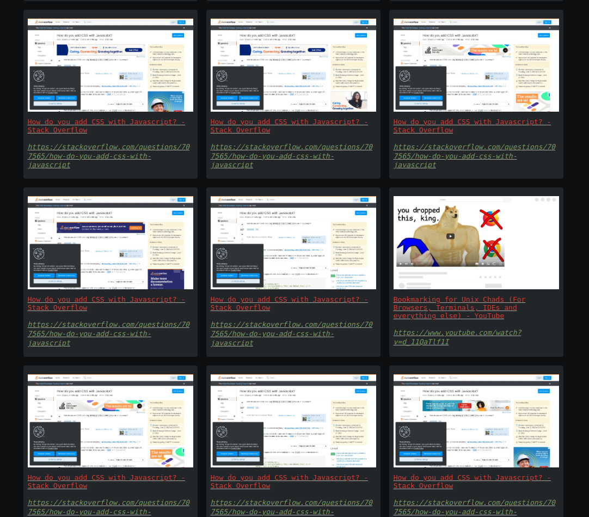

# Bookmark Service



## Prerequisite

If chromium is not in the /usr/bin/ then create a symbolic link to it in /usr/bin

```bash
sudo ln -s /nix/store/<chromium-directory>/bin/chromium /usr/bin/chromium-browser
```

## Installation

```bash
pnpm install
node index.js
```

## Violentmonkey Plugin

```javascript
// ==UserScript==
// @name        Bookmark Service Plugin
// @namespace   Violentmonkey Scripts
// @match       https://*/*
// @grant       GM_xmlhttpRequest
// @version     1.0
// @author      -
// @description Press F10 to save the current page as bookmark
// ==/UserScript==

console.log('---Bookmark Service----');

const styles = `
    .bookmark_notification {
      height: fit-content;
      min-height: 24px;
      display: flex;
      align-items: center;
      width: fit-content;
      z-index: 10000;
      background-color: green;
      color: #fff;
      font-size: 16px;
      position: fixed;
      top: 8px;
      right: 8px;
      padding: 8px 16px;
      border-radius: 4px;
      font-family: monospace;
    }
`;

document.onkeydown = (event) => {
  console.log("key: ", event.key);
  if (event.key === "F10") {
    const title = document.title;
    const url = window.location.href;
    const payload = { title, url };
    console.log("payload", payload);
    saveAsBookmark(payload);
  }
};

async function saveAsBookmark(payload) {
  GM_xmlhttpRequest({
    method: "POST",
    url: "http://localhost:9898/save_bookmark",
    data: JSON.stringify(payload),
    headers: {
      "Content-Type": "application/json",
    },
    onload: function (response) {
      // console.log(JSON.parse(response.responseText));
      const res = JSON.parse(response.responseText);
      if(res.success){
        showSuccessPrompt();
        addStylesheet(styles);
      }
    },
  });
}

async function showSuccessPrompt() {
  const notification = document.createElement("div");
  notification.classList.add("bookmark_notification");
  notification.textContent = "Page Bookmarked";

  const html = document.querySelector("html");
  html.appendChild(notification);

  await new Promise((resolve) => setTimeout(resolve, 2000));
  notification.remove();
}

function addStylesheet(cssString) {
  let style = document.createElement("style");
  style.type = "text/css";

  if (style.styleSheet) {
    // For IE8 and below
    style.styleSheet.cssText = cssString;
  } else {
    style.appendChild(document.createTextNode(cssString));
  }

  document.head.appendChild(style);
}

```

## Browser Instruction

- Press `F10` to save the current webpage as bookmark on the service.

- Open http://localhost:9898/ in browser to see your current bookmarks.


## Foot Notes

- Github, Dribble get priority over generic domains.
- You can add domains to group together your bookmarks.
- - For this you need to add your domain in the utils.js file and index.js file


#### Index.js

```javascript
const pre_requisite_db_file_paths = ["generic.json", "github.json", "dribble.json"];
```

#### utils.js

```javascript
  switch (domainName) {
    case "github.com":
      db = low(path.join(home, "db", "github.json"), { storage });
      break;
    case "dribbble.com":
      db = low(path.join(home, "db", "dribble.json"), { storage });
      break;
    default:
      db = low(path.join(home, "db", "generic.json"), { storage });
      break;
  }
```

- You don't need to create `executablePath: "chromium-browser"` property in puppeteer's launch fn. You can remove it to let it automatically detect chromium's executable path.

# TODOS

- Seach `feature`
- tags `feature`
- `bug` index.html should wait for screenshot to generate before rendering the bookmarks